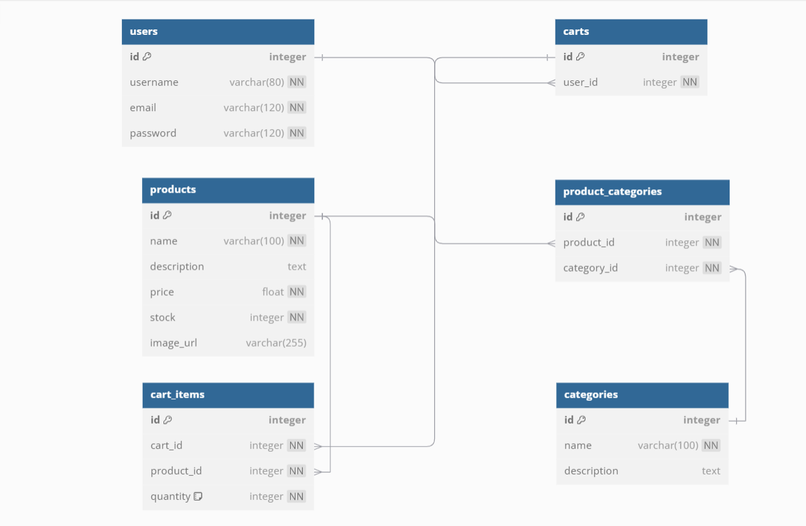

# MyJamii Store - README

## V1.1 - AI SEO Update

### MyJamii Store - AI-Powered E-commerce Platform

Welcome to the MyJamii Store, a next-generation e-commerce platform supercharged with cutting-edge AI for unparalleled SEO performance and content generation. This project demonstrates a full-stack e-commerce solution with a React frontend and a Python/Flask backend, now enhanced with the lightning-fast Groq AI inference engine.
Link to the application: <https://myjamii-store-client.onrender.com/>

### ✨ Key Features

#### E-commerce Core Features
- **Product Catalog:** Browse products by category, search, and view detailed product pages.
- **Shopping Cart:** Add products to a cart and manage cart items.
- **Checkout Process:** A seamless checkout experience.
- **Admin Dashboard:** Manage products and categories.

#### 🤖 AI-Powered SEO & Content (New!)
- **Automated Meta Tag Generation:** AI-powered generation of SEO-optimized titles and descriptions for all pages.
- **AI-Enhanced Product Descriptions:** On-demand AI generation of persuasive and keyword-rich product descriptions.
- **Structured Data (Schema Markup):** Dynamically generated `Product`, `Organization`, and `BreadcrumbList` schema for rich search results.
- **Groq Integration:** Utilizes the Groq API for high-speed, low-cost AI inference.

#### 🚀 Advanced SEO & Performance
- **Dynamic SEO Head:** A centralized React component (`SEOHead.jsx`) for managing all SEO-related meta tags.
- **Performance Caching:** 24-hour caching of AI-generated content in `localStorage` to reduce API calls and improve page load times.
- **Static Site Files:** `sitemap.xml` and `robots.txt` to guide search engine crawlers.
- **Vite-Powered Frontend:** A fast and modern frontend build tool.

### 💻 Technology Stack

- **Frontend:** React, Vite, Tailwind CSS, `react-helmet-async`
- **Backend:** Python, Flask, SQLAlchemy
- **AI:** Groq SDK (Mixtral-8x7b model)
- **Database:** PostgreSQL (or SQLite for development)
- **Deployment:** Render

### 📂 Project Structure

```
myjamii-store/
├── client/
│   ├── src/
│   │   ├── components/
│   │   │   ├── SEOHead.jsx           # ✨ Dynamic SEO component
│   │   │   └── ProductList.jsx       # ✨ Enhanced with AI features
│   │   ├── services/
│   │   │   └── groqSEOService.js     # ✨ AI service layer
│   │   └── App.jsx                   # ✨ HelmetProvider integration
│   ├── public/
│   │   ├── sitemap.xml               # ✨ Static sitemap
│   │   └── robots.txt                # ✨ Crawler directives
│   └── .env.example                  # ✨ Environment template
├── server/
│   ├── routes/
│   │   ├── admin_ai_routes.py
│   │   ├── ai_routes.py
│   │   └── seo_routes.py
│   ├── services/
│   │   ├── groq_ai_service.py
│   │   └── intelligent_ai_service.py
│   ├── app.py
│   └── models.py
├── AI_SEO_SETUP_GUIDE.md             # ✨ New AI SEO setup guide
├── README.md
```

### 🚀 Getting Started

#### Prerequisites
- Node.js and npm
- Python and pip
- A Groq API Key (get one from [Groq Console](https://console.groq.com/))

#### 1. Clone the Repository
```bash
git clone https://github.com/your-username/myjamii-store.git
cd myjamii-store
```

#### 2. Backend Setup
```bash
cd server
pip install -r requirements.txt
# Set up your database in models.py
python seed.py # To seed the database
flask run
```

#### 3. Frontend Setup
```bash
cd client
npm install

# Create a .env file from the example
cp .env.example .env
```
Now, add your Groq API key to the `.env` file:
```env
VITE_GROQ_API_KEY=gsk_your_actual_groq_api_key_here
```

Finally, run the development server:
```bash
npm run dev
```
Your application should now be running on `http://localhost:5173`.

### 🤖 AI SEO Implementation Details

#### AI Service (`groqSEOService.js`)
This service is the heart of the AI integration. It handles:
- Communication with the Groq API.
- Caching of AI-generated content to `localStorage`.
- Prompts for generating meta tags and product descriptions.

#### Dynamic SEO Component (`SEOHead.jsx`)
This component dynamically updates the document head with SEO-related tags. It takes a `type` prop (e.g., `product`, `homepage`) and relevant data to generate:
- `<title>` and `<meta name="description">` tags.
- Canonical URLs.
- Open Graph and Twitter card tags.
- JSON-LD structured data.

#### Caching Strategy
To optimize performance and reduce costs, AI-generated content is cached in the browser's `localStorage` for 24 hours. This means that for a returning user, the content is loaded instantly without making a new API call.

### 🗺️ Roadmap

This project has a bright future! Here are some of the planned enhancements:
- **Dynamic Sitemap Generation:** Automatically update the sitemap when new products or categories are added.
- **AI-Powered Alt Text:** Generate descriptive alt text for product images to improve accessibility and image SEO.
- **Voice Search Optimization:** Optimize content for voice search queries.
- **A/B Testing for SEO:** Automatically test different versions of meta tags to see what performs best.

### 🤝 Contributing

Contributions are welcome! Please feel free to submit a pull request.

1. Fork the repository.
2. Create a new branch (`git checkout -b feature/your-feature`).
3. Make your changes.
4. Commit your changes (`git commit -m 'Add some feature'`).
5. Push to the branch (`git push origin feature/your-feature`).
6. Open a pull request.

### 📄 License

This project is licensed under the MIT License.

---

## V1.0 - Initial Project Setup

# Fullstack Development

# MyJamii Store E-commerce App

Welcome to your no.1 most trusted online store. We are more than proud to serve you, our dear beloved customer.

In the following is a well-outlined structure of the app and how it works.

## App Structure

```plaintext
myjamii-store/
├── client/
│   ├── public/
│   ├── src/
│   │   ├── assets/
│   │   ├── components/
│   │   │   ├── About.jsx
│   │   │   ├── AdminDashboard.jsx
│   │   │   ├── Cart.jsx
│   │   │   ├── CategoryFilter.jsx
│   │   │   ├── Checkout.jsx
│   │   │   ├── Footer.jsx
│   │   │   ├── Home.jsx
│   │   │   ├── Login.jsx
│   │   │   ├── Navbar.jsx
│   │   │   ├── ProductList.jsx
│   │   │   ├── Signup.jsx
│   │   ├── App.css
│   │   ├── App.jsx
│   │   ├── index.css
│   │   ├── main.jsx
│   ├── images/
│   ├── vite.config.js
│   ├── package.json
│   ├── package-lock.json
│   ├── README.md
│   ├── .gitignore
│   ├── eslint.config.js
├── server/
│   ├── migrations/
│   ├── models.py
│   ├── app.py
│   ├── alembic.ini
│   ├── seed.py
│   ├── Pipfile
│   ├── Pipfile.lock
│   ├── requirements.txt
├── images/
│   ├── image.jpg
```

## FRONTEND CONFIGURATION

### Description

- *App*: The main component that renders the overall layout of the application.
- *Navbar*: Provides navigation links.
- *Main Content*: Uses a flex container to display the primary content and sidebar.
  - *CategoryFilter*: Allows users to filter products by category.
  - *Outlet*: Renders dynamic content based on the route.
    - *Products*: Displays a list of products with their details and an "Add to Cart" button.
    - *ProductDetail*: Shows detailed information about a single product.
    - *AddProduct*: Contains a form for adding new products.
    - *Checkout*: Manages the checkout process with a cart summary and a checkout form.
- *Sidebar*: Displays the shopping cart.
  - *Cart*: Lists cart items, shows the total, and includes a "Proceed to Checkout" button.
- *Footer*: Contains additional information and links.

## Component Details

### App.jsx

The App component is the main component that serves as the central hub for managing application state and rendering various parts of the UI.

*Purpose*:

- Manage Application State: Handles the state for products, cart items, categories, and the selected category.
- Fetch Data: Retrieves product data and categories from the server.
- Rendering: Displays the main content area, including a category filter, product list, and shopping cart.

*Logic and Functionality*:

- State Management
- Data Fetching with useEffect
- Cart Management Functions
- Category Handling
- Rendering the UI

### AdminDashboard.jsx

The AdminDashboard component provides administrators with tools to manage products and categories efficiently.

*Purpose*:

- Manage Products: Add, edit, or delete products in the store.
- Manage Categories: Create new categories for product organization.
- Image Upload: Integrate with Cloudinary for image management.

*Logic and Functionality*:

- Form Handling: Using Formik for form management.
- State Management: Managing product and category states.
- API Integration: Making Axios calls to the backend for product and category management.

### Products.jsx

The Products component is designed to display a list of products, with the ability to filter products by category and add products to a shopping cart.

*Purpose*:

- Display Products: Renders a list of product cards.
- Filter Products: Shows products based on the selected category.
- Add to Cart: Allows users to add products to their shopping cart.
- Product Details: Provides a link to view detailed information about each product.

*Logic and Functionality*:

- Context Access
- Filtering Products
- Rendering Product Cards

### ProductDetail.jsx

The ProductDetail component is designed to display detailed information about a specific product.

*Purpose*:

- Retrieve and display detailed information for a specific product.

*Logic and Functionality*:

- Extracting the Product ID
- Managing State
- Fetching Product Data
- Loading State
- Rendering Product Details

### AddProduct.jsx

The AddProduct component allows users to input details about a new product and submit these details to a backend server.

*Purpose*:

- Enable users or administrators to add new products to the database.

*Logic and Functionality*:

- State Management
- Handle Input Changes
- Handle Form Submission
- Form JSX

### CategoryFilter.jsx

The CategoryFilter component allows users to filter products based on their categories.

*Purpose*:

- Provide a dropdown menu for users to select a category and filter products.

*Logic and Functionality*:

- Props
- Rendering the Dropdown
- Populating the Dropdown
- Display and Layout

### Cart.jsx

The Cart component is designed to display the shopping cart's contents, calculate the total price of the items, and provide options to remove items or proceed to checkout.

*Purpose*:

- Display the shopping cart's contents.
- Calculate the total price of items.
- Provide options to remove items or proceed to checkout.

*Logic and Functionality*:

- Props
- Total Calculation
- Render Logic
- Conditional Rendering
- CSS Styling (Inline)

### Checkout.jsx

The Checkout component is designed to handle the checkout process for a shopping cart.

*Purpose*:

- Display a summary of cart items.
- Calculate the total amount.
- Provide a form for users to enter payment information.

*Logic and Functionality*:

- Using Outlet Context
- Handling Form Submission
- Displaying Cart Summary
- Rendering the Checkout Form

### Main.jsx

The Root component sets up the routing and state management for the React application.

*Purpose*:

- Routing Configuration
- State Management
- Render Main Application

*Logic and Functionality*:

- State Management
- Cart Management Functions
- Router Setup
- Route Configuration
- Rendering the Component Tree

## Styling (index.css)

### Media Queries

Media queries are used to apply different styles based on the screen width, ensuring that the layout adapts to various devices.

- For screens up to 1200px
- For screens up to 992px
- For screens up to 768px
- For screens up to 576px
- Checkout page adjustments for up to 768px

### Global Styles

- Body
- Navigation
- Main Content and Layout
- Product Cards
- Buttons and Links
- Forms and Inputs

## Summary

The MyJamii Store E-commerce App is a comprehensive online shopping platform with the following key features:

1. Responsive Design: Adapts to different screen sizes for optimal user experience.
2. Product Management: Displays products, allows filtering by category, and provides detailed product views.
3. Shopping Cart: Users can add items to the cart, view cart contents, and proceed to checkout.
4. Checkout Process: Simulates a payment process (for demonstration purposes).
5. Admin Functionality: Includes an interface for adding new products to the store.
6. State Management: Efficiently manages application state for products, cart, and user interactions.
7. Routing: Utilizes React Router for seamless navigation between different views.

This application demonstrates a full-featured e-commerce solution, showcasing React's capabilities in building interactive and dynamic web applications.

## Technologies Used

- React.js
- React Router for navigation
- Axios for API requests
- CSS for styling (with inline styles for components)
- React Icons for UI icons

## Installation and Setup

1. Clone the repository:
2. Navigate to the project directory:
3. Install dependencies:
4. Start the development server:
5. Open <http://localhost:3000> in your browser to view the application.

## API Integration

The application integrates with a backend API hosted at <https://myjamii-store-client.onrender.com/>. Ensure the API is running and accessible for full functionality.

## Contributing

Contributions to MyJamii Store are welcome! Please follow these steps:

1. Fork the repository
2. Create a new branch: `git checkout -b feature-name`
3. Make your changes and commit them: `git commit -m 'Add some feature'`
4. Push to the branch: `git push origin feature-name`
5. Submit a pull request

## SERVER SIDE CONFIGURATIONS

### ERD DIAGRAM



## RELATIONSHIP

#### Database Schema

- `users`: Stores information about users of the platform.
- `carts`: Represents shopping carts created by users. A cart belongs to a user through the `user_id` foreign key.
- `products`: Stores information about products sold on the platform.
- `product_categories`: Acts as a bridge between products and categories. A product can belong to multiple categories.
- `categories`: Stores information about the different categories of products.
- `cart_items`: Stores information about the items added to a cart. A cart item links a cart to a product and specifies the

 quantity.

#### Relationships

- A user can have one cart.
- A cart can contain multiple products through cart_items.
- A product can belong to multiple categories.

---

Feel free to adjust any sections further!
